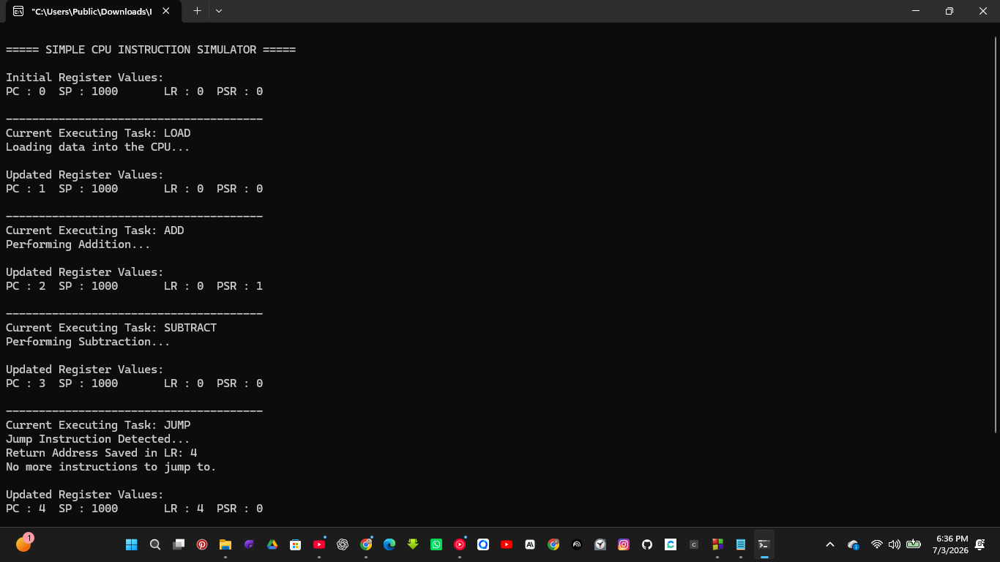

# Simple CPU Instruction Simulator

## Overview

This project is a simple simulation of the CPU instruction execution cycle using the C programming language. It combines the concepts learned from the previous projects by demonstrating how multiple CPU registers work together while executing different instructions.

The simulator executes a sequence of instructions (**LOAD**, **ADD**, **SUBTRACT**, and **JUMP**) one after another while updating the simulated CPU registers whenever necessary. After each instruction is executed, the current state of the registers is displayed to show how the processor changes during execution.

The goal of this project is to gain a practical understanding of how a processor executes instructions and how different CPU registers cooperate during the execution cycle.

---

## Project Objective

The objectives of this project are to:

* Simulate a simple CPU instruction execution cycle.
* Execute different instructions sequentially.
* Update the Program Counter (PC), Link Register (LR), and Program Status Register (PSR) when required.
* Display the register values after every instruction.
* Understand how multiple CPU registers work together during program execution.

---

## CPU Registers Used

### Program Counter (PC)

The Program Counter stores the location of the next instruction to execute. After each instruction is completed, the Program Counter is increased so execution continues with the next instruction.

---

### Stack Pointer (SP)

The Stack Pointer keeps track of the top of the stack. In this simulation, no stack operations such as **PUSH**, **POP**, or **CALL** are performed, so the Stack Pointer remains unchanged throughout the program.

---

### Link Register (LR)

The Link Register stores the return address after a jump or function call.

When the **JUMP** instruction is executed, the simulator saves the next instruction location inside the Link Register to represent a return address.

---

### Program Status Register (PSR)

The Program Status Register stores information about the processor's current status.

During arithmetic operations, the PSR is updated to simulate changes in the processor's state after executing an instruction.

---

## Project codes file

[Click here to check out the project file](code)

## Project images




## Instructions Used

The simulator executes the following instructions:

* LOAD
* ADD
* SUBTRACT
* JUMP

Each instruction represents a basic CPU operation and demonstrates how different registers may be affected during execution.

---

## How the Program Works

The program begins by declaring four variables that represent the CPU registers:

* Program Counter (PC)
* Stack Pointer (SP)
* Link Register (LR)
* Program Status Register (PSR)

Each register is assigned an initial value.

Next, an array of instructions is created.

```text
Instruction 0 → LOAD
Instruction 1 → ADD
Instruction 2 → SUBTRACT
Instruction 3 → JUMP
```

The Program Counter starts at **0**, pointing to the first instruction.

The program then enters a loop where it performs the following steps:

1. Fetch the current instruction using the Program Counter.
2. Display the instruction being executed.
3. Simulate the operation associated with that instruction.
4. Update the necessary CPU registers.
5. Increase the Program Counter.
6. Display the updated register values.
7. Repeat the process until every instruction has been executed.

This process closely follows the basic **fetch–execute cycle** performed by a processor.

---

## Register Activity During Execution

| Instruction  | PC                            | SP        | LR                    | PSR       |
| ------------ | ----------------------------- | --------- | --------------------- | --------- |
| **LOAD**     | Moves to the next instruction | No Change | No Change             | No Change |
| **ADD**      | Moves to the next instruction | No Change | No Change             | Updated   |
| **SUBTRACT** | Moves to the next instruction | No Change | No Change             | Updated   |
| **JUMP**     | Moves to the next instruction | No Change | Stores Return Address | No Change |

---

## Program Flow

```text
Start
   │
   ▼
Initialize CPU Registers
   │
   ▼
Create Instruction List
   │
   ▼
Display Initial Register Values
   │
   ▼
Fetch Current Instruction
   │
   ▼
Execute Instruction
   │
   ▼
Update CPU Registers
   │
   ▼
Display Updated Register Values
   │
   ▼
More Instructions?
   │
 ┌─Yes──────────────┐
 │                  │
 ▼                  │
Execute Next        │
Instruction         │
 │                  │
 └──────────────────┘
   │
  No
   │
   ▼
Program Execution Completed
   │
   ▼
End
```

---

## Sample Output

```text
===== SIMPLE CPU INSTRUCTION SIMULATOR =====

Initial Register Values:
PC : 0    SP : 1000    LR : 0    PSR : 0

---------------------------------------
Current Executing Task: LOAD
Loading data into the CPU...

Updated Register Values:
PC : 1    SP : 1000    LR : 0    PSR : 0

---------------------------------------
Current Executing Task: ADD
Performing Addition...

Updated Register Values:
PC : 2    SP : 1000    LR : 0    PSR : 1

---------------------------------------
Current Executing Task: SUBTRACT
Performing Subtraction...

Updated Register Values:
PC : 3    SP : 1000    LR : 0    PSR : 0

---------------------------------------
Current Executing Task: JUMP
Jump Instruction Detected...
Return Address Saved in LR: 4
No more instructions to jump to.

Updated Register Values:
PC : 4    SP : 1000    LR : 4    PSR : 0

---------------------------------------
CPU Instruction Execution Completed Successfully.
```

---

## What I Learned

This project helped me understand how several CPU registers work together during the instruction execution cycle.

While developing this simulator, I learned that:

* The **Program Counter (PC)** controls which instruction is executed next.
* Different instructions affect different CPU registers depending on the operation being performed.
* The **Program Status Register (PSR)** changes after arithmetic operations to represent the processor's current status.
* The **Link Register (LR)** can store a return address during a jump operation.
* The **Stack Pointer (SP)** is responsible for stack management, but it only changes when stack-related operations such as **PUSH**, **POP**, **CALL**, or **RETURN** are performed.

Although this project is a simplified software simulation, it gave me a clearer understanding of how processors execute instructions and how CPU registers interact during the execution process.

---

## Concepts Covered

* CPU Registers
* Program Counter (PC)
* Stack Pointer (SP)
* Link Register (LR)
* Program Status Register (PSR)
* Instruction Execution Cycle
* Fetch–Execute Cycle
* Arrays
* Loops
* Conditional Statements
* Computer Architecture Fundamentals

---

## Project Demo Video

[Click here to check out the project Demo Video](video/simple_cpu_instruction_simulator_video.mp4)


## Possible Improvements

Some future improvements for this project include:

* Simulating memory access during instruction execution.
* Supporting additional CPU instructions such as **PUSH**, **POP**, **CALL**, and **RETURN**.
* Implementing branching and conditional jumps.
* Adding a simulated stack to demonstrate Stack Pointer operations.
* Creating a simple instruction decoder.
* Expanding the simulator into a more complete CPU emulator capable of executing user-defined instructions.

---

## Technologies Used

* **Programming Language:** C
* **Compiler:** GCC
* **Concepts Covered:**

  * CPU Registers
  * Instruction Execution
  * Fetch–Execute Cycle
  * Computer Architecture
  * Embedded Systems Fundamentals

---

## Conclusion

This project brings together the core concepts of CPU register simulation and instruction execution into a single program. By executing a sequence of instructions and updating the appropriate CPU registers, the simulator demonstrates how a processor manages program execution through the cooperation of the Program Counter, Stack Pointer, Link Register, and Program Status Register. It serves as a practical introduction to processor architecture and provides a strong foundation for building more advanced CPU and embedded systems simulations in the future.
